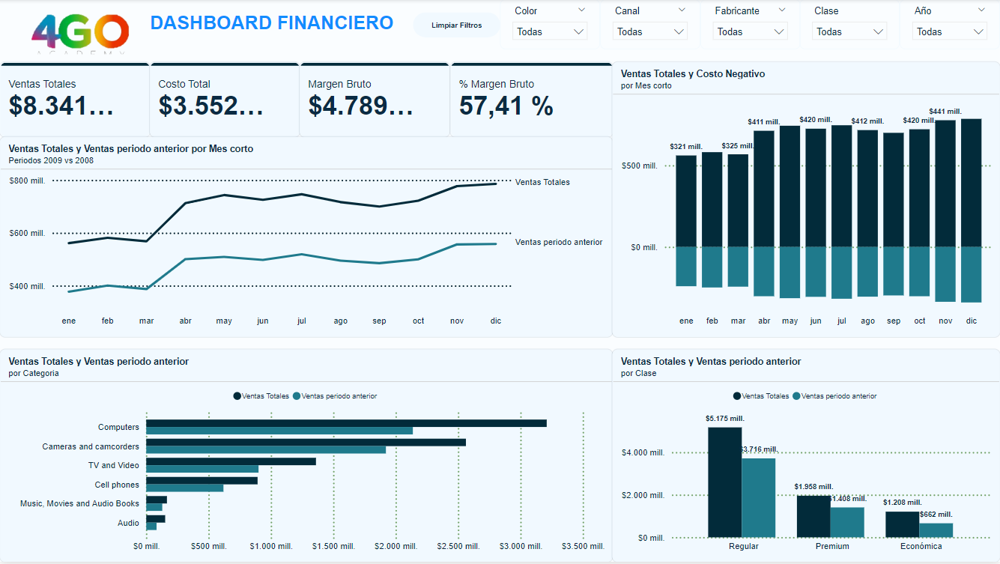

# Mi tercer informe en Power BI - 4GO

## Explicación

El tablero financiero proporciona información sobre las ventas totales, el costo total, el margen bruto, el porcentaje de margen bruto, las ventas totales por mes y la comparación de las ventas totales del periodo actual con el periodo anterior.

- **Ventas totales y costo total**: Las ventas totales de la empresa han aumentado a lo largo del periodo analizado, mientras que el costo total también ha aumentado pero a un ritmo menor. Esto ha resultado en un margen bruto positivo.

- **Margen bruto**: El margen bruto de la empresa es del 57.41%, lo que indica que la empresa está generando una ganancia saludable por cada dólar de ventas.

- **Ventas totales por mes**: Las ventas totales fluctúan a lo largo del año, pero no hay una tendencia estacional clara.

- **Comparación de ventas totales**: Las ventas totales en el periodo actual parecen ser más altas que en el periodo anterior en la mayor parte del año analizado.

En conclusión, el informe financiero indica que la empresa está en una posición financiera saludable con ventas totales en aumento, costos totales controlados y un margen bruto positivo. Si bien no hay una tendencia estacional clara en las ventas totales mensuales, las ventas totales del periodo actual parecen ser mayores que las del periodo anterior en la mayor parte del año analizado.

