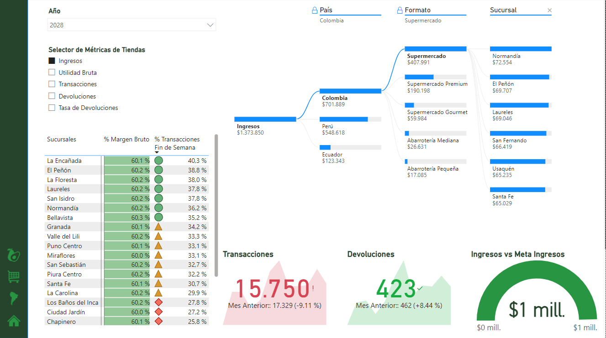

# Proyecto Power BI - Udemy

## Resumen Ejecutivo

El informe del Power BI muestra el desempeño de ventas de una tienda a lo largo de varios meses.  Los indicadores clave de rendimiento (KPIs) que se muestran incluyen los siguientes:

- **Utilidad bruta**: La utilidad bruta del mes actual es de $70,379. El mes anterior fue de $78,518, lo que representa una disminución del 10.37%.
- **Transacciones**: El número de transacciones del mes actual es de 15,750. El mes anterior fue de 17,329, lo que representa una disminución del 9.11%.
- **Devoluciones**: El número de devoluciones del mes actual es de 423. El mes anterior fue de 462, lo que representa un aumento del 8.44%.
El informe también muestra un desglose de los ingresos mensuales por país a lo largo del año 2028.  Además, muestra un desglose de las transacciones e ingresos por marca.

En conclusión, el informe de Power BI proporciona una instantanea del desempeño de ventas de la tienda durante el mes actual, en comparación con el mes anterior.  Si bien las ventas brutas y las transacciones disminuyeron, el número de devoluciones aumentó.  El informe también muestra un desglose de los ingresos por país y marca.

## Mapa

En esta página de informe se puede notar un mapa con las transacciones por tienda, además de la ubicación.

Como se puede notar, es Medellin la que presenta el mayor numero de transacciones.

## Tiendas

El informe incluye métricas de desempeño de ventas como ingresos, margen bruto, transacciones y retorno sobre la inversión (ROI) para varias tiendas en diferentes países de Sudamérica.

- **Desempeño de ventas por región**: El informe destaca a Colombia, Venezuela y Ecuador, lo que podría indicar que son las regiones de mejor desempeño 5. Puedes analizar si estas regiones están superando a otras o simplemente tienen un mayor volumen de ventas.

- **Desempeño de ventas por tienda**: Es posible que puedas ver si ubicaciones específicas de tiendas tienen un rendimiento inferior en comparación con otras, identificadas por menores ingresos o números de transacción 5.

- **Rentabilidad por tienda**: El informe muestra el margen bruto, que indica la rentabilidad después de contabilizar el costo de los bienes vendidos 5.  Esto puede ayudarte a identificar tiendas con márgenes más bajos que podrían requerir una investigación más profunda.

- **Retorno sobre la inversión (ROI)**: El informe te permite evaluar si el retorno sobre la inversión (ROI) cumple con las expectativas 5. Las tiendas con una alta tasa de devoluciones podrían indicar la necesidad de revisar la calidad del producto o las estrategias de precios.

## Marcas

El informe incluye métricas de desempeño de ventas como ingresos, margen bruto, transacciones, tasa de devolución y productos que generan mayor utilidad..

- **Rentabilidad por producto**: El informe permite ver el margen bruto de cada producto, lo que indica su rentabilidad 5.  Por ejemplo, el yogur natural tiene un margen bruto del 64.1%, lo que indica una alta rentabilidad 5.

- **Productos con mayor utilidad**: El informe identifica el producto que generó la mayor utilidad bruta en un periodo determinado 5.  En este caso, el informe señala que los tomates maduros generaron la mayor utilidad bruta 5.

- **Tasa de devolución**: El informe muestra la tasa de devolución por producto, lo que permite identificar aquellos con una tasa de devolución superior al promedio 5.  Por ejemplo, la mostaza tiene una tasa de devolución del 1.8%, la cual es superior al promedio 5.

En conclusión, este informe de Power BI proporciona información valiosa sobre la rentabilidad de los productos vendidos en diferentes países de Sudamérica 5.  La información obtenida puede ser útil para tomar decisiones de negocio acertadas, como enfocar las ventas en productos más rentables o identificar productos con alta tasa de devolución para analizar las causas e implementar estrategias de mejora.

