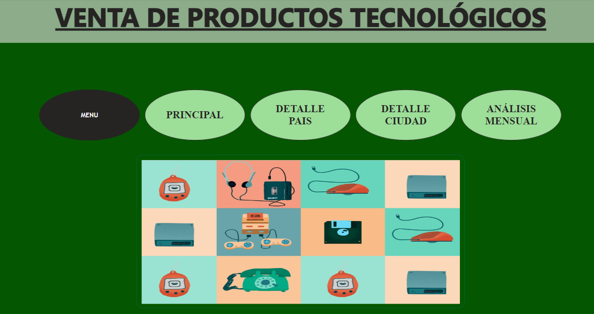
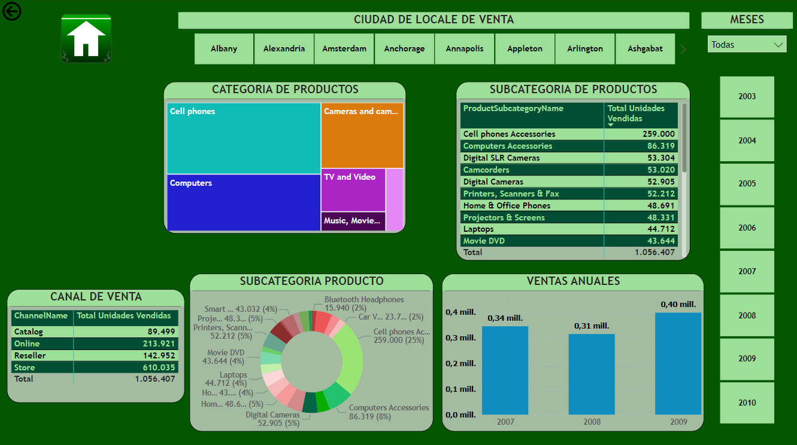

# Proyecto Power BI - Universidad de Concepción

## Portada (Menú Principal)

Este menú sirve para moverse dentro del panel de dashboards de manera interactiva, simple y amigable para los interesados.

## Principal (Explicación)

El informe de Power BI proporciona información sobre las ventas totales realizadas por una tienda en un periodo determinado, desglosadas por país, región, ciudad, nombre del producto y categoría de producto.  Las principales conclusiones son las siguientes:

- **Ventas por país**: China parece ser el país que más vendió en el periodo analizado (144.648 unidades vendidas), seguido de Canada (19.429) y Australia (9.866).

- **Ventas por región**: La región "América" parece ser la que más vendió en el periodo analizado (163.537 unidades vendidas), seguida de "Europa" (196.471) y "Oceanía" (9.866).

- **Ventas por ciudad**:  La ciudad que más vendió en el periodo analizado fue "Albany" (1.597 unidades vendidas), seguida de "Alexandria" (1.524) y "Amsterdam" (1.395).  Es importante tener en cuenta que no se puede determinar la representatividad de las ventas por ciudad sin conocer la distribución geográfica de las tiendas de la empresa.

- **Productos más vendidos**:  El producto más vendido fue  "Contoso In-Line Coupler E180 Silver" (19.020 unidades vendidas), seguido de "Contoso Rubberized Skin BlackBerry E100 Black" (15.660) y "Contoso Rubberized Skin BlackBerry E100 White" (13.300).

- **Ventas por categoría**: La categoría de producto que más vendió fue "Celulares" (383.009 unidades vendidas), seguida de "Audifonos y Cámaras" (188.324) y "Música, Peliculas y Libros Audio" (43.644).

En conclusión, el informe proporciona una visión general del rendimiento de ventas de la empresa en distintas geografías y categorías de productos.  Si bien China continental parece ser el país con mayores ventas, la región "América" parece aglutinar la mayor cantidad de ventas en total.

## Detalle País

- **Ventas por región**: El informe puede desglosar las ventas totales por región geográfica (por ejemplo, América del Norte, Europa, Asia). Esto puede ayudar a identificar qué regiones generan la mayor parte de los ingresos y dónde puede haber oportunidades de expansión.

- **Ventas por país**: A continuación, puede desglosar las ventas por región en ventas por país individual. Esto puede revelar qué países son los mercados más sólidos y dónde puede ser necesaria una estrategia de marketing más específica.

- **Ventas por ciudad**:  Si el informe incluye datos a nivel de ciudad,  puede ser útil para identificar mercados urbanos fuertes pero tenga en cuenta que esto también podría estar sesgado por la distribución geográfica de las tiendas.

- **Ventas por producto**: El informe puede mostrar qué productos se venden más en general y en cada región. Esto puede ayudar a informar las decisiones sobre el inventario, la publicidad y la expansión del producto a nuevos mercados.

- **Ventas por canal**: El informe puede desglosar las ventas por canal de ventas (por ejemplo, en línea, tiendas físicas, distribuidores). Esto puede ayudar a comprender qué canales son más efectivos para llegar a los clientes.

En conclusión, un informe de Power BI sobre ventas globales puede proporcionar información valiosa sobre el rendimiento de una empresa en diferentes geografías, categorías de productos y canales de ventas. Al analizar estos insights, las empresas pueden tomar decisiones informadas sobre cómo asignar recursos, expandirse a nuevos mercados y optimizar sus estrategias de ventas.

# Detalle Ciudad

Basado en la información que usted proporcionó, el informe de Power BI parece mostrar las ventas totales realizadas por una tienda en un periodo determinado, desglosadas por país, región, ciudad, nombre del producto y categoría de producto.  Las posibles conclusiones son las siguientes:

- **Ventas por región**: La región "América" parece ser la que más vendió en el periodo analizado (163.537 unidades vendidas), seguida de "Europa" (196.471) y "Oceanía" (9.866).

- **Ventas por país**:  China continental parece ser el país que más vendió en el periodo analizado (144.648 unidades vendidas), seguido de Canada (19.429) y Australia (9.866).

- **Ventas por ciudad**:  La ciudad que más vendió en el periodo analizado fue "Albany" (1.597 unidades vendidas), seguida de "Alexandria" (1.524) y "Amsterdam" (1.395).  Es importante tener en cuenta que no se puede determinar la representatividad de las ventas por ciudad sin conocer la distribución geográfica de las tiendas de la empresa.

- **Productos más vendidos**:  El producto más vendido fue  "Contoso In-Line Coupler E180 Silver" (19.020 unidades vendidas), seguido de "Contoso Rubberized Skin BlackBerry E100 Black" (15.660) y "Contoso Rubberized Skin BlackBerry E100 White" (13.300).

- **Ventas por categoría**: La categoría de producto que más vendió fue "Celulares" (383.009 unidades vendidas), seguida de "Audifonos y Cámaras" (188.324) y "Música, Peliculas y Libros Audio" (43.644).

En conclusión, el informe proporciona una vision general del rendimiento de ventas de la empresa en distintas geografías y categorías de productos.  Si bien China continental parece ser el país con mayores ventas, la región "América" parece aglutinar la mayor cantidad de ventas en total.

# Análisis Mensual

- **Ventas totales**:  Parece que las ventas totales aumentaron de enero de 2007 a diciembre de 2007, y luego disminuyeron de enero de 2008 a diciembre de 2008 [5].

- **Estacionalidad**:  Tambien podría haber estacionalidad en las ventas, lo que significa que las ventas pueden fluctuar a lo largo del año. Por ejemplo, las ventas podrían ser más altas en determinados días festivos o épocas del año [5].

- **Comparación año tras año**: Sería útil comparar las ventas totales de cada mes con las ventas del mismo mes del año anterior. Esto podría revelar si las ventas están aumentando o disminuyendo año tras año [5].

En conclusión, si bien el informe de Power BI que usted describe proporciona una instantánea de las ventas mensuales a lo largo de dos años, un análisis más profundo podría revelar tendencias o patrones más específicos. Sería interesante analizar las ventas por región, producto o categoría de producto para comprender mejor los impulsores de las ventas.

